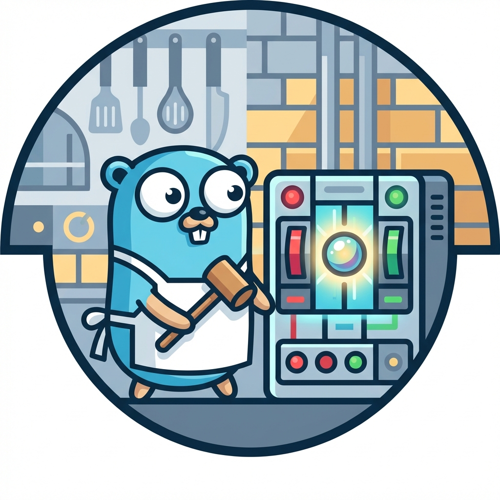

# ⚡ BallBreaker

<p align="center">
  
  <br>
  <b>Stop the snowball.</b>
</p>

[](https://pkg.go.dev/github.com/diegohce/ballbreaker)
[](https://goreportcard.com/report/github.com/diegohce/ballbreaker)
[](https://github.com/diegohce/ballbreaker/actions/workflows/ci.yml)
[](https://opensource.org/licenses/Apache-2.0)

**BallBreaker** is a high-performance, thread-safe Circuit Breaker pattern implementation for Go. It helps you prevent cascading failures in distributed systems by providing a robust mechanism to gracefully handle service degradation.

## ✨ Features

- 🔒 **Thread-Safe**: Built with concurrency in mind using `sync.Mutex`.
- 🚀 **Performant**: Zero-allocation state transitions during steady state.
- 🛠️ **Configurable**: Thresholds for failures, successes, and recovery timeouts.
- 📊 **State Inspection**: Real-time monitoring of the circuit status.
- 🔔 **Hooks**: Support for `OnStateChange` callbacks for logging and metrics.
- ✅ **Tested**: ~95% code coverage and verified with `-race` detector.

## ⚡ Performance

BallBreaker is designed for high-concurrency environments with zero allocations in the hot path.

| Benchmark | Operations | Speed | Allocations |
|-----------|------------|-------|-------------|
| `Do` (Closed State) | 32,298,302 | ~38 ns/op | 0 B/op (0 allocs) |
| `Do` (Parallel/16 CPUs) | 8,577,854 | ~144 ns/op | 0 B/op (0 allocs) |

> *Numbers based on local benchmarks (Intel i9-10980HK).*

## 🕹️ Quick Start

### Installation

```bash
go get github.com/diegohce/ballbreaker
```

### Usage

```go
package main

import (
	"fmt"
	"net/http"
	"time"

	"github.com/diegohce/ballbreaker"
)

func main() {
	// Create a new breaker with options: 
	cb := ballbreaker.New(
		ballbreaker.WithMaxFailures(3),
		ballbreaker.WithMaxSuccesses(2),
		ballbreaker.WithTimeout(5*time.Second),
	)

	err := cb.Do(func() error {
		// Your potentially failing logic here
		resp, err := http.Get("http://example.com")
		if err != nil {
			return err
		}
		defer resp.Body.Close()
		
		if resp.StatusCode >= 500 {
			return fmt.Errorf("server error: %d", resp.StatusCode)
		}
		return nil
	})

	if err != nil {
		fmt.Printf("Operation failed or circuit is open: %v\n", err)
	}
}
```

### 🔔 Monitoring and Hooks

BallBreaker allows you to react to state changes, which is perfect for emitting metrics or logging.

```go
cb := ballbreaker.New(
    ballbreaker.WithMaxFailures(3),
    ballbreaker.WithOnStateChange(func(from, to ballbreaker.CircuitStateType) {
        log.Printf("Circuit status changed from %v to %v", from, to)
    }),
)
```

## 📐 How it works

The circuit breaker has three states:

1.  **Closed**: The normal state. Requests flow normally. If failures exceed the `maxFailures` threshold, the circuit **Opens**.
2.  **Open**: Requests fail immediately without executing the function. After the `timeout` expires, the next request will transition the circuit to **Half-Open**.
3.  **Half-Open**: A limited number of trial requests are allowed. If `maxSuccesses` are reached, the circuit **Closes**. If any request fails, it reverts to **Open**.

## 🍕 Inspiration

The name **BallBreaker** is a tribute to the fictional arcade game featured in the restaurant  "The Original Beef of Chicagoland" from the TV series ***The Bear***. According to Matty Matheson's character Fak, Ballbreaker is a "Norwegian knock-off of Mortal Kombat."

## 🛡️ License

This project is licensed under the Apache License 2.0 - see the [LICENSE](LICENSE) file for details.

---
> **BallBreaker** — *Stop the snowball.*
